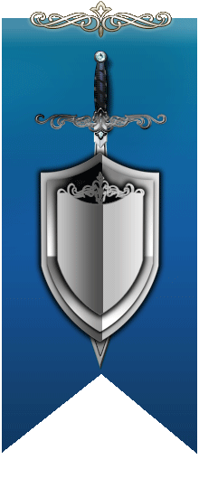

# OBS overlay - Stats
*Custom overlay created for Battle of the Braves standalone section*


### Index

:bar_chart: Fast navigation

* [about](README.md#about)
* [content](README.md#content)
* [author note](README.md#author-note)
* [support and contact](README.md#contact)
* [social network](README.md#links)

## :inbox_tray: [Download Source and full documentation](https://github.com/cssmfc/obs/releases/tag/v1.0.Stats)

### About
This OBS overlay shows animated content (using CSS3 keyframes).
Please note that after the overlay has been enabled, it has a 1.4s before starting the CSS animation in order to display the full content
* Red Knights
  * revealed with a delay of 1.4s after the overlay has been activated
  * top banner image
  * animated flag in the left side
  * team header title using editable plain text (Metamorphous font)
  * 6 Premium Usernames displayed in cascade transition with 8s delay animation starting with the first one
    * each Premium Username has the team's icon in front
  * token value animated micro banner set as background image and editable token value using plain text
* Blue Lords
  * revealed with a delay of 3.4s after the overlay has been activated
  * top banner image
  * animated flag in the left side
  * team header title using editable plain text (Metamorphous font)
  * 6 Premium Usernames displayed in cascade transition with 8s delay animation starting with the first one
    * each Premium Username has the team's icon in front
  * token value animated micro banner set as background image and editable token value using plain text
 

**OBS overlay type:** browser

**Source:** local

**Coded:** HTML, CSS

**Resources:** MicroFLF font, Metamorphous font, static and animated images


:wrench: General install of OBS overlays downloaded form our platform:
1. Download and extract the content from zip file
2. Open OBS, click the + button/icon from Sources manager window
3. Select the Browser option from the available options panel
4. Select Local file checkbox , browse button and select the html file provided
5. Set up the width and height of the overlay (it depends on what the overlay is showing)
6. Select the Refresh checkbox
7. Tweak the position of the installed overlay by dragging the red lines or corners
8. To trigger overlay visibility use the eye icon to show or hide

### Install instructions
**How to use this overlay and how to edit it?**

In order to edit the content of the ShowStatus.html you must edit the source markup of the web page. Notepad++ (Windows users), TextWrangler (MAC users) will do the job or you can use the compiled [Source Editor](https://github.com/cssmfc/obs/tree/master/source_editor_tool) already provided inside the downloaded folder
To use this overlay on your stream follow the install steps suggested below

1. Open **OBS** [download OBS if necessary](https://obsproject.com/)
2. From **Sources** zone click the :heavy_plus_sign: sign/icon
3. Next step is to select **Browser** from available options 


4. **Create New** will show up, give it a name, easy to spot 


5. **Local File** - Browse. **Browse** for the file Bars.html. Make sure you select **Local File** option 

 Settings visible in screenshot
 
7. Drag the red corners to fit your main screen source for better position


8. Optional, you can play with Transition and Fade Transition options when triggering this overlay, it is up to you.
- Studio Mode must be enabled on OBS


### Content

:open_file_folder: This GitHub repository is holding markup codes, detailed documentation used for this OBS overlay along with graphics resources, install instructions and Source Editor tool


### Author Note

:memo: **Please read**
* the overlay is not interactive, it is not triggered by tips.
* all editing process is made via source code
* all resources run locally from your device (desktop/laptop)
* the overlay is triggered manually by the model
* overlay developed for Chaturbate webcam performers.

Reference markup code for the Red Knights box
```html
<!-- Red Knights Box -->
<div class="cgc-6 wrapper-redteam">
<div class="cgc-12 no imgresp tcenter fixupred">
<!-- Red Knights Box - top image -->
</div>
<div class="cgc-12 breds bgtrans">
 <div class="cgc-4 redteam tleft no imgresp">
     <!-- Red Knights Box - Animated Flag-->
   </div>
  <div class="cgc-8 teamred">
      <h3 class="title">Red Knights</h3><!-- Red Knights Box - Title-->
      <div class="cl-12 premiums">
         <p>Premium Username</p><!-- Red Knights - listed premiums / Do not add more -->
         <p>Premium Username</p>
         <p>Premium Username</p>
         <p>Premium Username</p>
         <p>Premium Username</p>
         <p>Premium Username</p>
         <p>600 tokens</p><!-- Red Knights - Edit token values  -->
      </div>
  </div>
</div>
</div>
```

Reference markup code for the Blue Lords box

```html
<!-- Blue Lords Box -->
<div class="cgc-6 wrapper-blueteam">
<div class="cgc-12 no imgresp tcenter fixupblue">
<!-- Blue Lords Box top image-->
</div>
<div class="cgc-12 bblues bgtrans">
  <div class="cgc-8 teamblue">
      <h3 class="title">Blue Lords</h3><!-- Blue Lords Section Title-->
      <div class="cl-12 premiums">
         <p>Premium Username</p><!-- Blue Lords - listed premiums  / Do not add more -->
         <p>Premium Username</p>
         <p>Premium Username</p>
         <p>Premium Username</p>
         <p>Premium Username</p>
         <p>Premium Username</p>
         <p>600 tokens</p><!-- Blue Lords - Edit token values -->
      </div>
  </div>
  <div class="cgc-4 blueteam tleft no imgresp">
     <!-- Blue Lords - Animated Flag -->
   </div>
</div>
</div>
```
The layout of this overlay is using responsive values defined by `cgc-` class
HTML and CSS are commented


**Install instructions and full documentation along with all necessary resources provided inside the downloaded file**


### Contact

:mailbox_with_no_mail: For questions, feedback, suggestions, feel free to contact the [support staff](https://camgirl.cloud/contact/) 


### Links 

:link: CGC is active on social networks and other platforms:

[Twitter](https://www.twitter.com/CamgirlCloud) | [Facebook Group](https://www.facebook.com/groups/studio.camgirl.cloud) | [YouTube](https://www.youtube.com/channel/UCbJQMNUNpK1Pt-uGyOq7iQw) | [Website](https://camgirl.cloud/) | [Reddit](https://www.reddit.com/r/CamgirlLiveEditor/) | [XBIZ TV](https://www.xbiz.tv/channel/1479112767/CamgirlCloud/) | [Discord Server](https://discord.gg/2XvqfsJ) 
